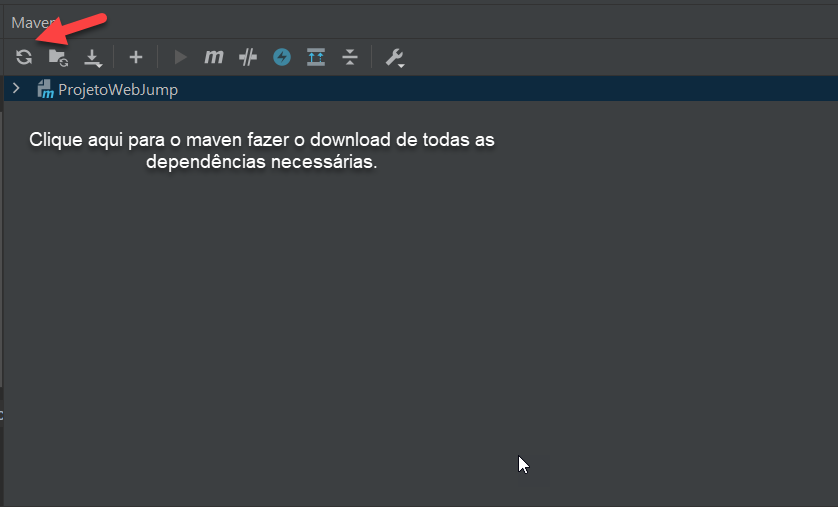
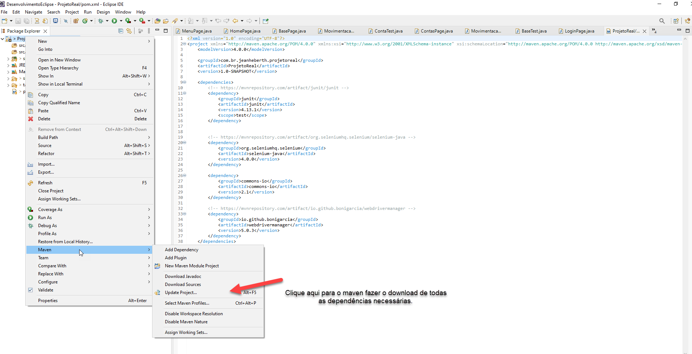
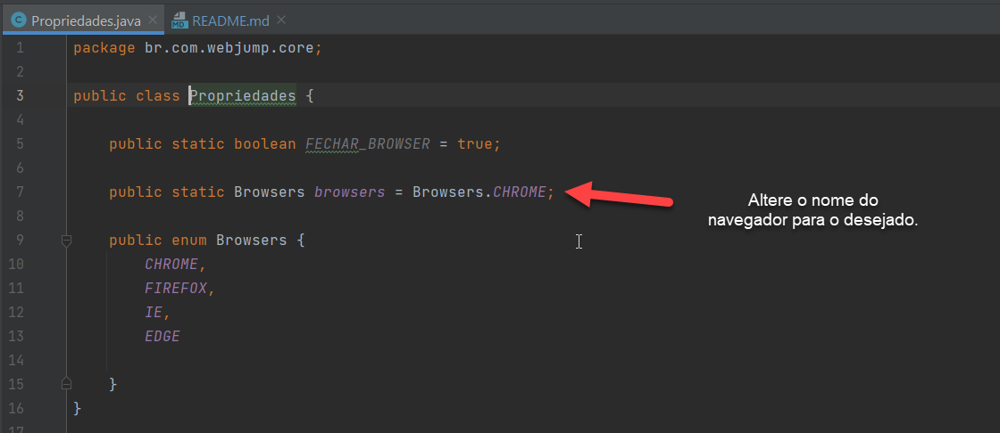
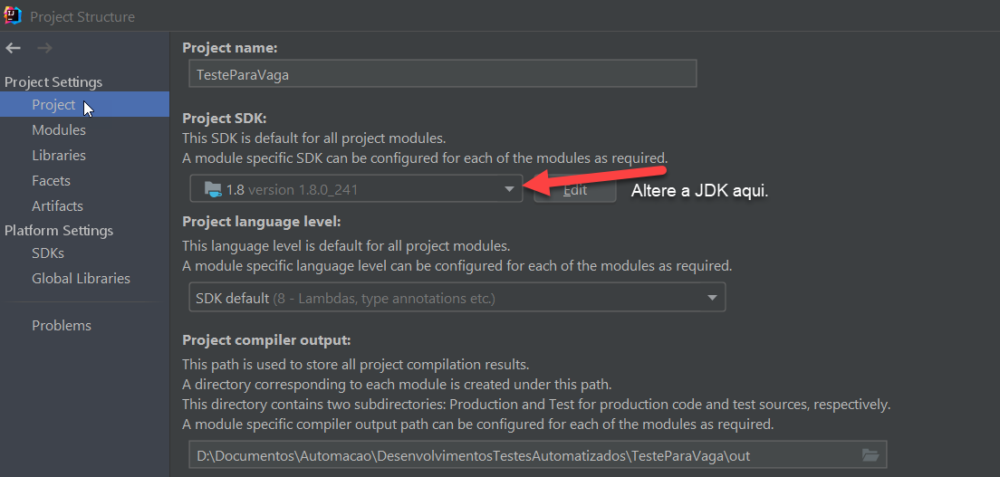
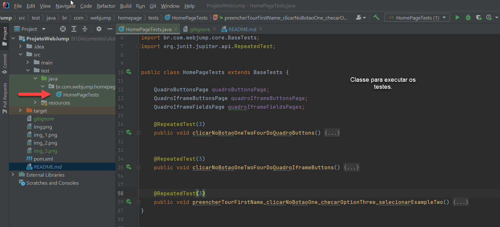

# ProjetoWebJump
Esse projeto foi desenvolvido para o teste e estudos.

Para criação desse projeto foi utilizado a ide Intellij e framework's Selenium, Junit 5 e a Hamecrest.

<h3>Como executar o projeto</h3>

Faça o clone do projeto para a sua máquina, e abra-o em sua ide de preferência. Após abri-lo, faça a importação das bibliotecas que já estão incluídas no arquivo pom.xml.

<h3>Como fazer a importação da bibliotecas<h3>

<h3>Intellij</h3>
Abra o projeto clonado na ide Intellij, abra a aba do Maven que fica no lado direito da IDE, e clique na opção Reload All Projects Maven, que está localizado no menu superior dentro da aba Maven.

<h3>Eclipse</h3>
Abra o projeto clonado na ide Eclipse, clique com o botão direito do mouse em cima do projeto, selecione a opção maven e no submenu que irá aparecer, clique na opção 
Update Project.

<h2>Atenção</h2>

Para esse projeto, não será necessário setar o drive do navegador na configuração do classe, pois foi utilizando uma biblioteca para identificar os navegadores de testes
de acordo com sua necessidade. Caso deseje alterar o navegador, acesse a classe Propriedades e selecione o navegador desejado, já está configurado para o sistema reconhecer o navegador 
chrome com padrão, porém já está salvo os outros três navegadores utilizados para testes, IE, EDGE, Firefox, sendo assim, é so escolher.

<h3>JDK</h3>

Caso não tenha a jdk configurada, altere as configurações do jdk do projeto clonado, e seleciona a
jdk que vc tenha em sua máquina. Ps. Utilizei a jdk 1.8_241

Após esses passos é só rodar a classe HomePageTests, que está dentro do src/test/java/br.com.webjump.homepage

